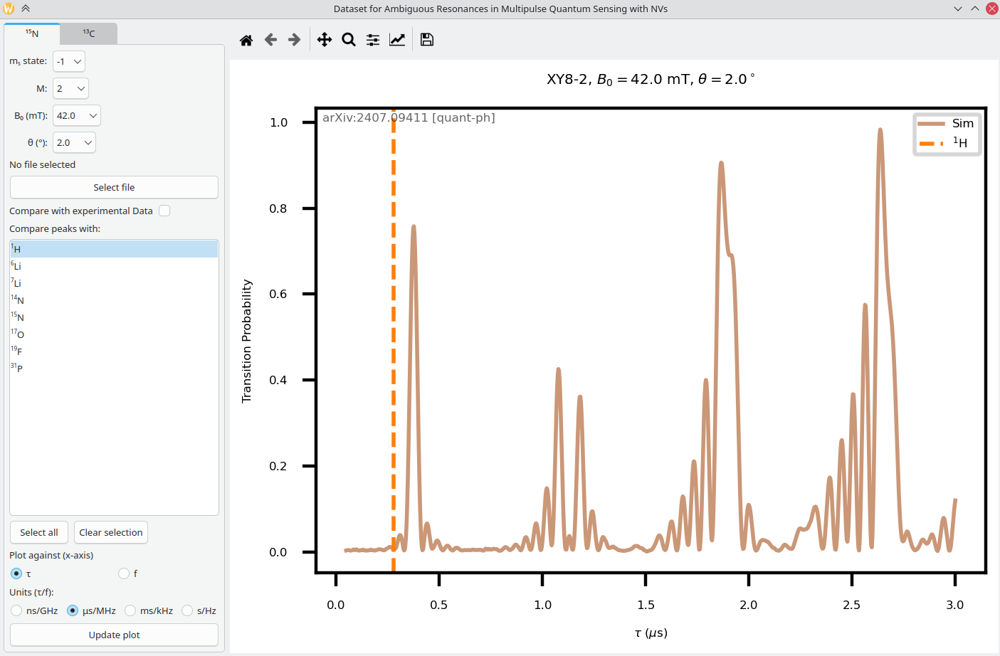

# Ambiguous Resonances Dataset

This repository contains the python script for the graphical user interface (GUI) application of the dataset from the paper *Ambiguous Resonances in Multipulse Quantum Sensing with Nitrogen Vacancy Centers in Diamonds* by *L. Tsunaki et al*, available at: <https://arxiv.org/abs/2407.09411>

It is used to visualize and analyze the simulations of ambiguous resonances contained in the dataset, available at <https://figshare.com/articles/dataset/Dataset_for_Ambiguous_Resonances_in_Multipulse_Quantum_Sensing_with_NVs/26245895> or <https://box.fu-berlin.de/s/ajm6wijbKWJQKQS>

In this GUI, the user can choose specific experimental parameters and compare with experimental data.



## Setup
The application provides a GUI based on the
Python bindings for Qt6. It has dependencies on `NumPy`, `Matplotlib`,
`PyQt6`/`PySide6`, and`PyTables`. Thus, we recommend creating a
`conda` virtual environment with:

```sh
conda create --name dataset-env python
conda activate dataset-env 
conda install numpy matplotlib pyside6 pytables
```

## Usage

Download the HDF5 file from [here](https://figshare.com/articles/dataset/Dataset_for_Ambiguous_Resonances_in_Multipulse_Quantum_Sensing_with_NVs/26245895) or [here](https://box.fu-berlin.de/s/ajm6wijbKWJQKQS) and place it in the same directory as the script. 

<details>

<summary>Optional: verify the integrity of the downloaded dataset</summary>

## sha256 checksum

To make sure that the dataset was downloaded correctly, we provide the sha256 checksum. Run `sha256sum dataset.h5` on the downloaded file to obtain the checksum. It should match `8913fb153dec5251285c2126a30f42c1d7e7f085b39a207fcb235470bad9c2fd`.

</details>


And then to launch the GUI, one can simply run the following command in the cloned repository within the conda environment:

```sh
python dataset_gui.py
```

This will launch the GUI with the standard HDF5 file. However, if the
user wants to have a different dataset file, the `–-dataset` flag can be
used as follows:

```
python dataset_gui.py --dataset /PATH/CUSTOM_DATASET.hdf5
```

The use of the GUI is intuitive and self-explanatory. There are two
tabs, one for <sup>15</sup>N and the other for <sup>13</sup>C ambiguous resonances.
The $m_s$ state of the electronic spin transition should be chosen, with
the order $M$ of the XY8 sequence, the bias magnetic field $B_0$, minimum
and maximum $\tau$ or $f$ range. In addition, for <sup>15</sup>N, the angle
$\theta$ must be specified and for <sup>13</sup>C, the carbon families. The
expected resonances from the gyromagnetic ratios of other nuclear spins
can also be compared with. 

A text file with experimental data can be
plotted together with the simulation for spectral disambiguation, with
the conditions that it can be read by `numpy.loadtxt` and its first
column representing $\tau$ or $f$ in the correct units and the second
indicating the XY8 intensity. Finally, the plot can be customized and
exported.

New simulations for ambiguous resonances are intended to be added to the
dataset in the following months of the publishing of this paper.
Depending on user feedback, the GUI might also undergo alterations.

## Structure of the HDF5 file

The HDF5 file contains 3 groups, one each for <sup>15</sup>N, <sup>13</sup>C, and constants. The table structure for the data is:

### <sup>15</sup>N: `n15_group`

| order | field | field_angle | ms  | data |
|-------|-------|-------------|-----|------|
| ...   | ...   | ...         | ... | ...  |

`order`: order of the XY8 sequence  
`field`: static magnetic field in mT  
`field_angle`: field misalignment angle in degrees  
`ms`: spin state excited (+1 or -1)  
`data`: the time series data for the simulated fluorescence  

### <sup>13</sup>C: `c13_group`

| order | fam | field | ms  | data |
|-------|-----|-------|-----|------|
| ...   | ... | ...   | ... | ...  |

`order`: order of the XY8 sequence  
`fam`: <sup>13</sup>C family  
`field`: static magnetic field in mT  
`ms`: spin state excited (+1 or -1)  
`data`: the time series data for the simulated fluorescence  
